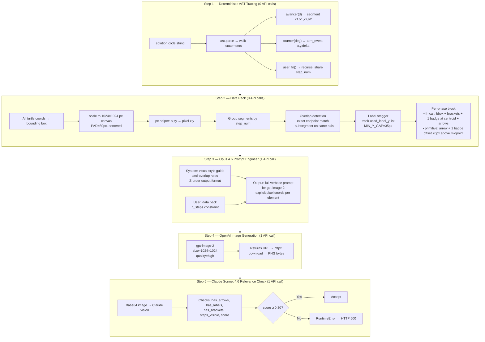

# Design Exercise Image Annotation Pipeline

## What We Built and Why

AlgoPython feedback can include an annotated image that visually decomposes an exercise into its repeating steps. For **robot** exercises this was already working (PIL arrows drawn over a grid screenshot). For **design** exercises (turtle graphics — `avancer`, `tourner`, user-defined functions) we needed something completely different: a clean, standalone dark-canvas image showing the full decomposition in one picture, matching the reference image style.

---

## Current Architecture

### High-Level Flow

```mermaid
flowchart TD
    A[POST /feedback/image] --> B{exercise_type?}
    B -- robot --> C[_run_robot_pipeline]
    B -- design --> D[_run_design_pipeline]
    B -- other --> E[HTTP 500 — unsupported type]

    C --> C1[Claude analyzes screenshot\ngrid bounds calibration]
    C1 --> C2[Parse hint / solutions\n→ path steps]
    C2 --> C3[steps_to_drawings\nPIL fraction coords]
    C3 --> C4[draw_annotations on screenshot\ncolored arrows overlay]
    C4 --> C5[pixel-diff guard\nretry once if unchanged]
    C5 --> Z

    D --> D1[trace_design_path\nAST turtle simulation]
    D1 --> D2[design_to_drawings\nfor xml_desc only]
    D2 --> D3[build_design_annotation_prompt\npixel-precise data pack]
    D3 --> D4[Claude Opus 4.6\ncrafts gpt-image-2 prompt]
    D4 --> D5[OpenAI gpt-image-2\nstandalone dark canvas 1024×1024]
    D5 --> D6{image returned?}
    D6 -- No → D7[RuntimeError → HTTP 500]
    D6 -- Yes --> D8[Claude Sonnet 4.6\nrelevance check score 0–1]
    D8 --> D9{score ≥ 0.30?}
    D9 -- No --> D10[RuntimeError → HTTP 500\nwith score + issues]
    D9 -- Yes --> D11[Gemini coherence check\nlogged only]
    D11 --> Z[Save PNG → /feedback-generation/api/feedback/images/uuid]
```

---

### Design Pipeline Detail



---

### Color Conventions (matching reference images)

| Color | Hex | Meaning |
|---|---|---|
| Orange | `#F97316` | Direct `avancer` / `arc` calls (approach / transition) |
| Blue | `#3B82F6` | 1st user function call (Boucle 1) |
| Pink | `#EC4899` | 2nd user function call (Boucle 2) |
| Teal | `#14B8A6` | 3rd user function call (Boucle 3) |
| Yellow | `#FBBF24` | Start marker chevron |
| White | `#FFFFFF` | Corner brackets, turn arcs, end marker |

### Coordinate System

- Turtle origin: `(0, 0)`, angle `0° = right`, **positive = clockwise** (screen y-down convention)
- `dx = cos(θ)`, `dy = sin(θ)` — mountains drawn with `tourner(-120)` (left turns) produce **negative y peaks**, which map to the top of the canvas correctly without any y-axis flip
- Canvas: `1024×1024 px`, `PAD=80px` on all sides, drawing centered in remaining area

---

## Key Files

| File | Role |
|---|---|
| `agents/orchestrator.py` | `_run_design_pipeline` — orchestrates all 5 steps; `_generate_design_image_prompt` — calls Opus 4.6 |
| `robot/design_computer.py` | `trace_design_path` — AST turtle simulator; `design_to_drawings` — PIL fraction coords for xml_desc |
| `prompts/image.py` | `build_design_annotation_prompt` — pixel-precise data pack; `_label_side` — canvas space picker |
| `agents/gemini_agent.py` | `generate_image_openai` — OpenAI call; `check_annotation_relevance` — Claude Sonnet vision check |
| `core/config.py` | `open_ai_api_key`, `openai_image_model` settings (env var: `OPEN_AI_API_KEY`) |

---

## What We Tried and Rejected

### Attempt 1 — Per-step cell grid (original design approach)
`render_step_cell_grid` produced a grid of N small panels, one per step, each showing the previous steps faded in grey and the current step in color.

**Why it failed:** The user needed a single unified image showing all decomposition steps simultaneously, matching the AlgoPython reference image style. The cell grid was too small per cell and didn't match the reference aesthetic.

### Attempt 2 — Gemini image generation with base_image overlay
Used `generate_annotated_image` (Gemini 2.0 Flash with image output) to annotate the exercise screenshot directly — passing the screenshot as base image and a text prompt.

**Why it failed:** The generated image was completely unreadable. Coordinates were imprecise, elements overlapped heavily, and the dark-canvas style couldn't be achieved by overlaying annotations on a screenshot.

### Attempt 3 — Gemini image generation standalone (dark canvas)
Switched to `base_image=None` to generate a fresh dark canvas via Gemini, passing reference images as style examples.

**Why it failed:** Same quality issues — the model produced vague, unreadable results regardless of prompt detail. The user's manually crafted Gemini prompt (grid-based, named points A–H, explicit pixel precision) showed the quality bar required but the automated pipeline couldn't match it reliably.

### Attempt 4 — OpenAI gpt-image-2 with `response_format="b64_json"`
Added `response_format="b64_json"` to the OpenAI API call to receive base64 directly.

**Why it failed:** `gpt-image-2` does not accept the `response_format` parameter → `400 Unknown parameter`. Removed the parameter; the model returns a URL which is downloaded with httpx.

### Attempt 5 — PIL fallback on failure (silent)
`draw_annotations(base_image, drawings)` was used as a silent fallback whenever OpenAI returned `None` or relevance was too low.

**Why it was wrong:** The PIL fallback produced colored arrows overlaid on the exercise screenshot — visually identical to the robot pipeline output. The user was getting the wrong image every time with no error surfaced. All failures were invisible. Removed entirely for design exercises; failures now raise `RuntimeError → HTTP 500`.

### Attempt 6 — Gemini 2.0 Flash for relevance check
Used `gemini-2.0-flash` to evaluate whether the generated image contained the expected annotations.

**Why it failed:** `404 NOT_FOUND — This model models/gemini-2.0-flash is no longer available to new users.` Replaced with Claude Sonnet 4.6 vision check.

---

## Bugs Fixed Along the Way

| Bug | Symptom | Fix |
|---|---|---|
| `OPEN_AI_API_KEY` Pydantic mismatch | `Extra inputs are not permitted` on startup | Renamed Settings field to `open_ai_api_key` to match env var |
| `name 'settings' is not defined` | NameError in `_run_design_pipeline` error message f-string | Changed to `self._settings.openai_image_model` |
| NameError swallowed as Exception | Claude saw misleading *"requires robot exercise with \<map\> block"* hint; retried 3× | Changed tool loop to `except Exception: raise` — all image pipeline errors propagate as HTTP 500 |
| OpenAI returns URL not bytes | `img.b64_json` was None when `response_format` not specified | Code already handles URL via httpx download; `response_format` param removed |
| `openai` package not installed locally | `ModuleNotFoundError` silently returned `None`, PIL fallback used every time | Package was installed in container; local env mismatch was misleading |
| y-axis direction | Triangles pointed down (peaks at high pixel y) | Exercises use left turns `tourner(-120)` → negative y peaks → `(ty - min_ty)` maps them above baseline correctly |
| Per-segment badge repetition | Badge "2" drawn 3× on a triangle (once per segment) | Moved to one badge per **step** at bounding box centroid |
| Labels clustering at same y | Three `ma_montagne()` labels all placed left at y=511, 112px overlap | Added `used_label_y` tracking with `MIN_Y_GAP=35px`; subsequent calls stagger to above/below |

---

## Error Propagation (Design Only)

```
_run_design_pipeline
  └─ generate_image_openai raises OpenAI exception
       └─ wrapped → RuntimeError("OpenAI image generation API error: ...")
            └─ _run_image_generation raises it
                 └─ tool loop: except Exception: raise
                      └─ orchestrator.run() raises it
                           └─ _run_generation: except Exception → HTTPException 500
                                └─ caller receives {"detail": "Generation failed: ..."}
```

The robot pipeline is **not affected** — it retains its PIL fallback and pixel-diff retry logic unchanged.
